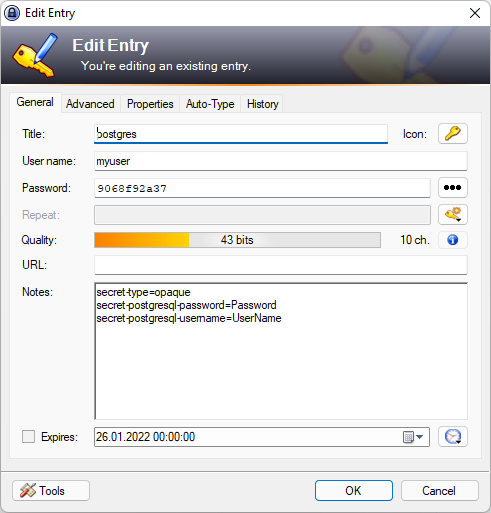
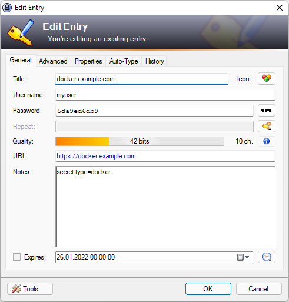
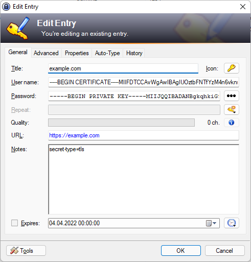

# keepass-secret

This command line tool converts entries from a KeePass 2.3 file into Kubernetes secrets in the form of a YAML file.\
This tool was created to automatically create Kubernetes Secret in CI/CD pipelines to deploy workloads to Kubernetes clusters.\
By using KeePass for encryption it is save to store this sensitive data in a source code control system.\
One major reason for this approach is that KeePass offers a wide variety of UIs for many platforms and the access key to the data is a single password, which is easy to communicate.

The following commands are supported:
- [Create secrets YAML file](#create-secrets-yaml-file)
- [Set fields of KeePass entry](#set-fields-of-keepass-entry)
- [Get value of KeePass entry field](#get-value-of-keepass-entry-field)
- [Export to JSON file](#export-to-json-file)
- [Import from JSON file](#import-from-json-file)
- [Create empty KeePass file](#create-empty-keepass-file)
- [Password Generator](#password-generator)

## Create secrets YAML file
```
keepass-secret secrets -d keepass.kdbx -p 1234 -o secrets.yaml
kubectl apply -n test -f secrets.yaml
```
Only values wil be exported which contain special annotations in the Notes field.\
The annotations must be prefixed with `secret-` and placed as separate lines in the Notes field.

### Opaque secrets
A line with `secret-type=opaque` marks the KeePass entry to be exported as an opaque Kubernetes secret.\
For each desired key/value pair in the secret, a line in the Notes field defines the mapping with the following syntax:\
`secret-<secret key name>=<KeePass field name>`

Example:
```
secret-type=opaque
secret-postgresql-password=Password
secret-postgresql-username=UserName
```


This entry will be exported as an opaque secret with the keys postgresql-username and postgresql-password.\
The value of `postgresql-username` is filled with the contents of the `UserName` field and\
the value of `postgresql-password` is filled with the contents of the `Password` field
>Any standard or custom property can be accessed this way.\
>Standard properties are e.g.: Title, UserName, Password, URL

Generated YAML:
```
apiVersion: v1
kind: Secret
metadata:
  name: "postgres"
type: Opaque
data:
  postgresql-password: "OTA2OGY5MmEzNw=="
  postgresql-username: "bXl1c2Vy"
```
>To use the reserved word 'type' as a key, escape it with a colon.\
>e.g. secret-:type=prop1

### Docker secrets
A line with `secret-type=docker` marks the KeePass entry to be exported as a Docker Kubernetes secret,\
which can be used as imagePullSecrets.



Generated YAML:
```
apiVersion: v1
kind: Secret
metadata:
  name: "docker.example.com"
type: kubernetes.io/dockerconfigjson
data:
  .dockerconfigjson: eyJhdXRocyI6eyJodHRwczovL2RvY2tlci5leGFtcGxlLmNvbSI6eyJ1c2VybmFtZSI6Im15dXNlciIsInBhc3N3b3JkIjoiNWRhOWVkNmRiOSIsImVtYWlsIjoibWFpbEBleGFtcGxlLmRlIiwiYXV0aCI6ImJYbDFjMlZ5T2pWa1lUbGxaRFprWWprPSJ9fX0=
```

### TLS secrets
A line with `secret-type=tls` marks the KeePass entry to be exported as a Kubernetes TLS secret, 
containing a certificate and its private key.\
The certificate must be stored in the UserName field and the private key in the Password field.\
Just copy/paste the PEM texts to the fields. KeePass will keep the line breaks.



Generated YAML:
```
apiVersion: v1
kind: Secret
metadata:
  name: "example.com"
type: kubernetes.io/tls
data:
  tls.crt: "LS0tLS1CRUdJTiBDRVJUSUZJQ0FURS...LQo="
  tls.key: "LS0tLS1CRUdJTiBQUklWQVRFIEtFWS...LQo="
```

### Tagging
A list of tags can be added to each entry.\
Example:
```
secret-tags=taga,tagb
```
In the export command the option -t/--tag can then be used to filter entries based on the tag.\
E.g. -t taga will export only those entries, which do have a taga in their tags list.

### Namespace
By default the exported secrets do not contain a namespace and therefore the namespace must be defined outside e.g. as parameter to the kubectl create/apply command.\
By adding the optional field `secret-namespace` a comma separated list of namespaces can be defined. For each namespace the export will create a separate entry in the export file.

## Set fields of KeePass entry
Create entry with set of fields.
```
keepass-secret set -d keepass.kdbx -p 1234 -e /entry-1 -f Password=1234 -f UserName=abc
```
- If the entry does not exist it will be created.
- If the entry exists it will be deleted and re-created with the new fields.
- The -e parameters specifies the path of the entry\
  /entry-1 entry in root group\
  /group-1/entry-1 entry in group group-1
- The parameter -f format is: `<field name>=<field value>`
- The parameter -f may be repeated to write multiple fields of a single entry at once.
- Passwords can be automatically generated by supplying a pattern in the password field\
  (see [Password Generator](#password-generator)).


## Get value of KeePass entry field
Get value of entry field and print it to stdout.
```
keepass-secret get -d keepass.kdbx -p 1234 -e /entry-1 -f Password
```
or assign to shell variable
```
PASSWORD=$(keepass-secret get -d keepass.kdbx -p 1234 -e /entry-1 -f Password)
```  


## Export to JSON file
Exports complete database to JSON, which can then be processed e.g. by [jq](https://stedolan.github.io/jq/).
```
keepass-secret export -d keepass.kdbx -p 1234 -o export.json
keepass-secret export -d keepass.kdbx -p 1234 -o /dev/stdout | jq .
```
Example output:
```
[
  {
    "Password": "1234",
    "Title": "entry-1",
    "UserName": "abc",
    "path": "/entry-1"
  }
]
```
- Note that only plain text fields are supported (e.g. no support for attachments).
- The exported file can imported again with the import command (see below).
- Use -o /dev/stdout to output to stdout.


## Import from JSON file
Imports entries from JSON file.
```
keepass-secret import -d keepass.kdbx -p 1234 -i import.json
```
- Will generate passwords if pattern is present in the password field\
  (see [Password Generator](#password-generator)).
- Specify option `--dry-run` to avoid modifications of the database.\
  Only changes are reported to stdout.

## Create empty KeePass file
Initializes a new KeePass database file 
```
keepass-secret init -d keepass.kdbx -p 1234
```

## Password Generator
The import and set command support the generation of passwords.\
Use the pattern `"{<type><len>}"` in the password field.\
`<len>` is the password length\
`<type>` is one of the following types:

  **h** Lower-Case Hex Character\0123456789 abcdef\
  **H**	Upper-Case Hex Character	0123456789 ABCDEF\
  **A**	Mixed-Case Alphanumeric	ABCDEFGHIJKLMNOPQRSTUVWXYZ abcdefghijklmnopqrstuvwxyz 0123456789\
  **L**	Mixed-Case Letter	ABCDEFGHIJKLMNOPQRSTUVWXYZ abcdefghijklmnopqrstuvwxyz\
  **S**	Printable 7-Bit ASCII	from '!' (0x21) to '~' (0x7e)

  Example:\
    "{A32}" -> create password with 32 alphanumeric characters

## Credits
Thanks to Tobias Schoknecht for providing [gokeepasslib](https://github.com/tobischo/gokeepasslib).
